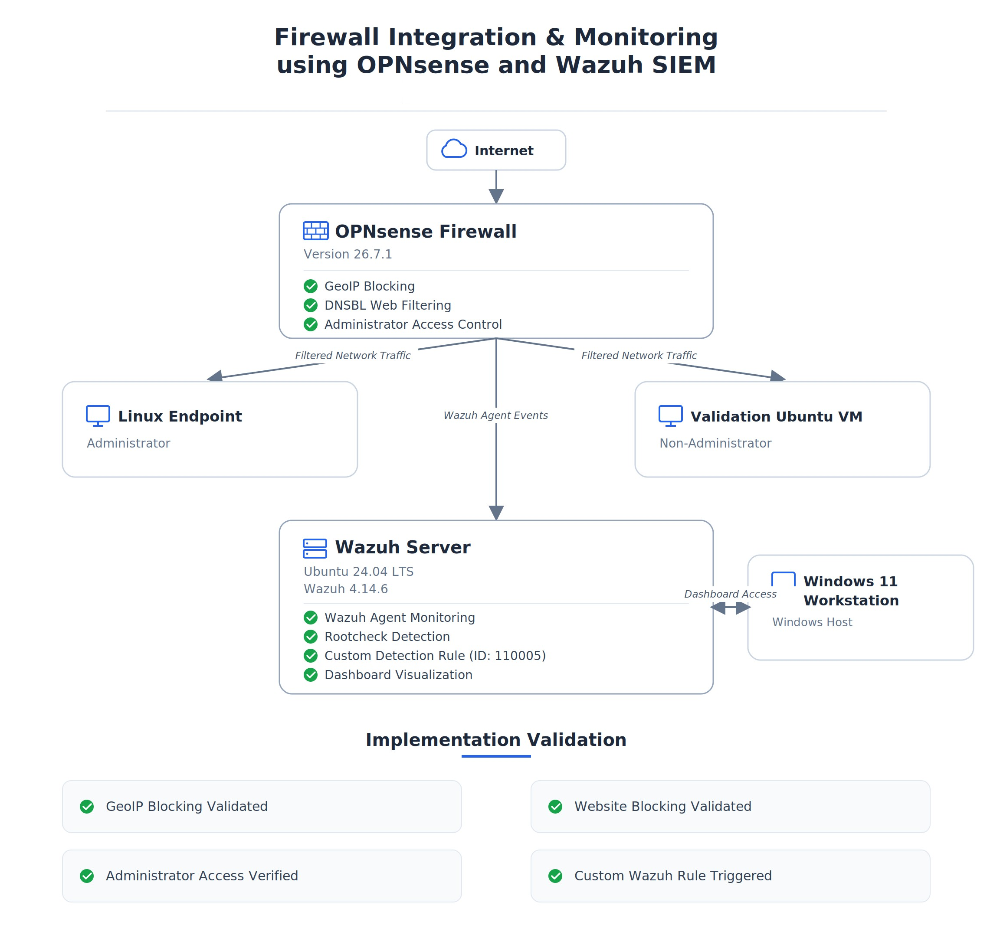

# Firewall Integration & Monitoring using OPNsense and Wazuh SIEM

## Overview

This project was completed as part of my SOC Internship to demonstrate the deployment of a firewall, implementation of network security policies and security monitoring using Wazuh SIEM within a virtualized lab environment.
The lab was built using VMware and includes an OPNsense firewall, Wazuh Server, Linux endpoints and a Windows workstation for dashboard access. The project focuses on configuring and validating firewall policies, monitoring endpoint security events and creating custom Wazuh detections for improved visibility.

> **Note:** This project was performed entirely in an isolated VMware lab using private RFC1918 IP addresses (`192.168.x.x`). No production systems or public infrastructure were involved.

## Objectives

- Deploy an OPNsense firewall within a VMware-based virtual lab.
- Configure core network services including WAN, LAN, DHCP, and DNS.
- Route endpoint traffic through the firewall for centralized policy enforcement.
- Implement and validate firewall security policies, including GeoIP blocking, DNS-based website blocking, and administrator access control.
- Monitor endpoint security events using the Wazuh Agent deployed on OPNsense.
- Create and validate a custom Wazuh detection rule for Rootcheck events.
- Build a custom Wazuh dashboard visualization to display rule activity.

## Technologies Used

| Category | Technology |
|----------|------------|
| Firewall | OPNsense 26.7.1 |
| SIEM | Wazuh 4.14.6 |
| Operating System | Ubuntu 24.04 LTS |
| Endpoint | Linux |
| Host Operating System | Windows 11 |
| Virtualization | VMware Workstation |
| DNS Filtering | Unbound DNS Block Lists (DNSBL) |
| GeoIP Provider | IPinfo Lite |

## Lab Environment

The project was implemented in an isolated VMware virtual lab consisting of the following systems:

| System | Purpose |
|---------|---------|
| OPNsense Firewall | Firewall, routing, DHCP, DNS, and security policy enforcement |
| Wazuh Server | Security monitoring, alerting, and dashboard visualization |
| Linux Administrator Endpoint | Firewall administration and policy testing |
| Ubuntu Validation VM | Validation of administrator access restrictions |
| Windows 11 Host | Access to the Wazuh Dashboard |

## Project Architecture

The following diagram illustrates the overall architecture of the virtual lab environment used throughout this project.



## Network Architecture

The lab environment was deployed using VMware Workstation and isolated from production networks. OPNsense acted as the central gateway between the internal virtual network and the external network. The Linux Administrator Endpoint and Ubuntu Validation VM communicated through the firewall, allowing security policies to be enforced and validated. Wazuh monitored endpoint activity through the Wazuh Agent installed on OPNsense, while the Wazuh Dashboard was accessed from the Windows 11 host system.

## Security Policies Implemented

### 1. GeoIP Blocking

- Configured GeoIP-based firewall rules using the IPinfo Lite database.
- Blocked traffic originating from China and Russia.
- Verified policy enforcement through OPNsense Firewall Live View.

### 2. DNS-Based Website Blocking

- Implemented website filtering using Unbound DNS Block Lists (DNSBL).
- Blocked access to **facebook.com**.
- Verified successful blocking using DNS resolution and browser testing.

### 3. Administrator Access Control

- Restricted HTTPS access to the OPNsense management interface.
- Verified that only the designated Linux Administrator Endpoint could access the firewall.
- Confirmed that the Ubuntu Validation VM was denied administrative access.

## Security Monitoring & Custom Detection

To enhance monitoring capabilities, the Wazuh Agent was deployed on the OPNsense firewall. Instead of relying on remote Syslog, endpoint security events generated by Rootcheck were monitored directly through the Wazuh Agent.

A custom Wazuh rule (Rule ID **110005**) was created to detect Rootcheck events generated by the OPNsense agent.

**Custom Rule Details**

| Property | Value |
|----------|-------|
| Rule ID | 110005 |
| Description | Custom: OPNsense rootcheck security event detected |
| Groups | local, opnsense, rootcheck, custom |

The custom rule was successfully validated and generated alerts that were visible within Wazuh Discover.

## Dashboard Validation

To improve visibility of the custom detection, a dedicated Wazuh dashboard visualization was created using the Wazuh Alerts index.

The dashboard displayed alerts generated by the custom rule (Rule ID **110005**), confirming that the detection was functioning correctly and allowing Rootcheck events from the OPNsense agent to be monitored through a centralized interface.

**Validation Results**

- Custom Data Table visualization created.
- Filtered using Rule ID **110005**.
- Successfully displayed **24** matching events during validation.

## Repository Structure

```text
.
├── architecture/     # Network architecture diagram
├── docs/             # Internship report and documentation
├── screenshots/      # Project validation screenshots
├── README.md         # Project documentation
└── LICENSE           # License (to be added)
```
## Screenshots

Representative screenshots demonstrating the implementation and validation of this project are available in the `screenshots` directory, including:

- OPNsense dashboard
- Firewall rule configuration
- GeoIP blocking validation
- DNS-based website blocking validation
- Administrator access control validation
- Custom Wazuh Rule (110005)
- Wazuh Discover results
- Custom Wazuh dashboard visualization

## Lessons Learned

Throughout this project, I gained practical experience in deploying and validating a firewall within a virtualized environment, implementing security policies, and monitoring endpoint activity using Wazuh SIEM.

I also learned the importance of validating security controls through testing, troubleshooting integration challenges, and documenting technical implementations accurately.
